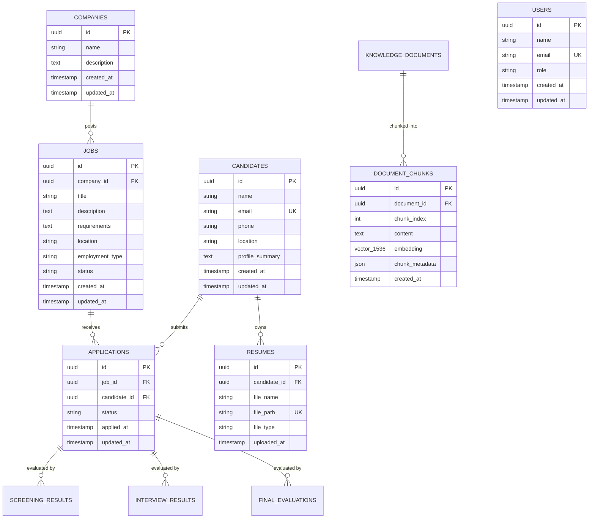

# TalentForge — AI-Powered Hiring Platform

**Phase 1: Project Foundation & Infrastructure**  
**Phase 2: Database & Storage (Supabase, pgvector & SQLAlchemy 2.x)**

TalentForge is an enterprise AI-powered hiring platform designed to orchestrate intelligent candidate discovery, automated resume evaluations, and structured interviews.

This repository implements **Phase 1 (Foundation)** and **Phase 2 (Database & Storage)**, providing a complete PostgreSQL + pgvector schema, Alembic migration pipeline, Supabase Storage integration, modular FastAPI REST API services, and interactive Next.js verification consoles.

---

## Tech Stack

| Domain | Technology | Details |
|---|---|---|
| **Database** | [Supabase](https://supabase.com/) / PostgreSQL | Cloud-managed PostgreSQL 15/16 |
| **Vector Search** | `pgvector` | Native 1536-dimensional vector embeddings for RAG foundation |
| **ORM** | [SQLAlchemy](https://www.sqlalchemy.org/) 2.x | Type-safe declarative models with connection pooling |
| **Migrations** | [Alembic](https://alembic.sqlalchemy.org/) | Reversible version-controlled database migrations |
| **Object Storage** | [Supabase Storage](https://supabase.com/docs/guides/storage) | Resume document storage with signed & public URLs |
| **Backend** | [FastAPI](https://fastapi.tiangolo.com/) | Asynchronous REST API, Pydantic v2 validation, structured logging |
| **Frontend** | [Next.js](https://nextjs.org/) 14 (App Router) | TypeScript, Vanilla CSS design system, modular CRUD test console |
| **Package Managers** | `pnpm` (Frontend), `uv` (Backend) | Fast, deterministic dependency management |
| **Containerization** | Docker & Docker Compose | Multi-container local orchestration |
| **Version Control** | Git | Clean commit boundaries |

---

## Database Schema Overview



---

## Supabase & Environment Setup

### 1. Configure Supabase Project
1. Create a project at [supabase.com](https://supabase.com).
2. Under **Project Settings > Database**, copy your PostgreSQL connection string (Transaction pooler or Session pooler).
3. Under **Project Settings > API**, retrieve your `Project URL`, `anon public` key, and `service_role` key.
4. Under **Storage**, create a new public or private bucket named `resumes` (or let the backend create it automatically).

### 2. Environment Variables (`.env`)
Copy `.env.example` to `.env`:

```bash
cp .env.example .env
```

Fill in your configuration:
```ini
# Application Mode
APP_ENV=development

# Database Connection (PostgreSQL with psycopg 3 driver for SQLAlchemy 2.x)
DATABASE_URL=postgresql+psycopg://postgres:<PASSWORD>@db.<PROJECT-REF>.supabase.co:5432/postgres

# Frontend & CORS
NEXT_PUBLIC_API_URL=http://localhost:8000
CORS_ORIGINS=http://localhost:3000,http://127.0.0.1:3000

# Supabase Storage & Client API
SUPABASE_URL=https://<PROJECT-REF>.supabase.co
SUPABASE_ANON_KEY=<ANON_KEY>
SUPABASE_SERVICE_ROLE_KEY=<SERVICE_ROLE_KEY>
SUPABASE_STORAGE_BUCKET=resumes

# Future Phase Integration Placeholders
LLM_API_KEY=
LANGFUSE_PUBLIC_KEY=
LANGFUSE_SECRET_KEY=
```

> **Security Note:** Service role keys are kept strictly on the FastAPI backend and never leaked to the frontend client.

---

## Database Migrations (Alembic)

Run database migrations to initialize tables and enable the `pgvector` extension:

```bash
cd backend
uv run alembic upgrade head
```

To create a new migration revision:
```bash
uv run alembic revision --autogenerate -m "add_new_columns"
```

---

## REST API Endpoints

Interactive Swagger UI documentation is available at `http://localhost:8000/api/v1/docs`.

### Telemetry & Health
- `GET /api/v1/health`: Probes API availability and database connectivity (`SELECT 1`).

### Companies
- `POST /api/v1/companies`: Create a company.
- `GET /api/v1/companies`: List all companies.
- `GET /api/v1/companies/{company_id}`: Retrieve company by UUID.

### Jobs
- `POST /api/v1/jobs`: Create a job posting (requires valid `company_id`).
- `GET /api/v1/jobs`: List jobs (supports optional `?company_id=` filter).
- `GET /api/v1/jobs/{job_id}`: Retrieve job by UUID.

### Candidates
- `POST /api/v1/candidates`: Register a candidate (unique email validation).
- `GET /api/v1/candidates`: List candidates with attached resumes.
- `GET /api/v1/candidates/{candidate_id}`: Retrieve candidate by UUID.

### Resume Document Storage
- `POST /api/v1/candidates/{candidate_id}/resume`: Upload a candidate resume file (`multipart/form-data`).
  - Allowed file types: `.pdf`, `.docx`, `.doc`, `.txt`.
  - Maximum file size: 10MB.
  - Automatically uploads to Supabase Storage and records metadata in database.

### Applications
- `POST /api/v1/applications`: Apply candidate to a job (foreign key validation).
- `GET /api/v1/applications`: List applications (supports `?job_id=` and `?candidate_id=` filters).
- `GET /api/v1/applications/{application_id}`: Retrieve application by UUID.

---

## Local Development Commands

### Backend (FastAPI + uv)
```powershell
cd backend
.\.venv\Scripts\Activate.ps1
uv pip install -e ".[dev]"
uv run alembic upgrade head
uv run uvicorn app.main:app --reload --port 8000
```

### Frontend (Next.js + pnpm)
```powershell
cd frontend
pnpm install
pnpm dev --port 3000
```
Visit `http://localhost:3000` to access the interactive Phase 2 Verification Console.

### Run Tests
```powershell
# Backend test suite (10/10 tests covering CRUD, FKs, storage, and health)
cd backend
.\.venv\Scripts\pytest.exe

# Backend linters
.\.venv\Scripts\ruff.exe check .

# Frontend contracts verification
cd frontend
pnpm test
```
