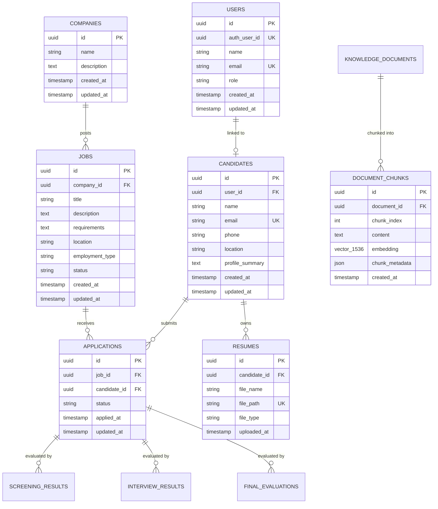

# TalentForge

**Phase 1: Project Foundation & Infrastructure**  
**Phase 2: Database & Storage (Supabase, pgvector & SQLAlchemy 2.x)**  
**Phase 3: Authentication & Role-Based Access Control (Supabase Auth & RBAC)**
**Phase 4: AI Resume Screening Agent & Scorecard**
**Phase 5: RAG Pipeline & MCP Tooling Foundations**
**Phase 6: AI-Powered Interview System**
**Phase 7: Multi-Agent Orchestration & A2A**

TalentForge is an enterprise AI-powered hiring platform designed to orchestrate intelligent candidate discovery, automated resume evaluations, and structured interviews.

This repository implements **Phase 1-6**, providing a complete PostgreSQL + pgvector schema, Alembic migration pipeline, Supabase Storage integration, Supabase Auth JWT verification, server-enforced role permissions, intelligent candidate screening via LLMs, RAG-enhanced generation using vector embeddings, and a multi-evaluator AI-driven interactive interview system.

---

## Tech Stack

| Domain | Technology | Details |
|---|---|---|
| **Database** | [Supabase](https://supabase.com/) / PostgreSQL | Cloud-managed PostgreSQL 15/16 |
| **Authentication** | [Supabase Auth](https://supabase.com/docs/guides/auth) | Email/Password, secure session management, JWT access tokens |
| **Vector Search** | `pgvector` | Native 1536-dimensional vector embeddings for RAG foundation |
| **ORM** | [SQLAlchemy](https://www.sqlalchemy.org/) 2.x | Type-safe declarative models with connection pooling |
| **Migrations** | [Alembic](https://alembic.sqlalchemy.org/) | Reversible version-controlled database migrations |
| **Object Storage** | [Supabase Storage](https://supabase.com/docs/guides/storage) | Private resume document storage with signed URLs |
| **Backend** | [FastAPI](https://fastapi.tiangolo.com/) | Asynchronous REST API, Pydantic v2 validation, RBAC dependencies |
| **Frontend** | [Next.js](https://nextjs.org/) 14 (App Router) | TypeScript, Vanilla CSS design system, role-aware navigation & portal |
| **Package Managers** | `pnpm` (Frontend), `uv` (Backend) | Fast, deterministic dependency management |
| **Containerization** | Docker & Docker Compose | Multi-container local orchestration |
| **Version Control** | Git | Clean commit boundaries |

---

## Authentication & RBAC Architecture

```text
Next.js (App Router)
   │ (Supabase Client: Email / Password)
   ▼
Supabase Auth
   │ (Issues JWT Access Token)
   ▼
FastAPI Backend (Authorization: Bearer <JWT>)
   │ (Validates token with Supabase & extracts auth_user_id)
   ▼
PostgreSQL Users Table (Loads Role: ADMIN | RECRUITER | CANDIDATE)
   │ (Server-side RBAC & Resource Ownership Enforcement)
   ▼
Protected Endpoints & Resources
```

### Role Definitions

1. **ADMIN**
   - Full system access.
   - Manage all companies, jobs, candidates, resumes, and applications.
   - Promote or update application user roles via `/api/v1/auth/users/{user_id}/role`.
   - List all registered users.

2. **RECRUITER**
   - Manage companies and create/update job postings.
   - List and view all candidates across the platform.
   - Access candidate resumes and cross-candidate application data.

3. **CANDIDATE**
   - Manage own candidate profile via `/api/v1/candidates/me`.
   - Upload and manage own resume files in private Supabase Storage.
   - View only own submitted applications.
   - Browse open job postings and apply on own behalf.
   - **Strictly blocked (403 Forbidden)** from viewing other candidates' data, modifying jobs/companies, or listing cross-candidate applications.

---

## Database Schema Overview



---

## Supabase & Environment Setup

### 1. Environment Variables (`.env`)
Copy `.env.example` to `.env`:

```bash
cp .env.example .env
```

Configuration reference:
```ini
# Application Mode
APP_ENV=development

# Database Connection (PostgreSQL with psycopg 3 driver for SQLAlchemy 2.x)
DATABASE_URL=postgresql+psycopg://postgres:<PASSWORD>@aws-0-ap-southeast-2.pooler.supabase.com:5432/postgres

# Frontend & CORS
NEXT_PUBLIC_API_URL=http://localhost:8000
CORS_ORIGINS=http://localhost:3000,http://127.0.0.1:3000

# Supabase Auth, Storage & API
SUPABASE_URL=https://<PROJECT-REF>.supabase.co
SUPABASE_PUBLISHABLE_KEY=<PUBLISHABLE_OR_ANON_KEY>
SUPABASE_SECRET_KEY=<SECRET_OR_SERVICE_ROLE_KEY>
SUPABASE_STORAGE_BUCKET=resumes

# Frontend client keys (never expose secret key!)
NEXT_PUBLIC_SUPABASE_URL=https://<PROJECT-REF>.supabase.co
NEXT_PUBLIC_SUPABASE_PUBLISHABLE_KEY=<PUBLISHABLE_OR_ANON_KEY>

# Initial Bootstrap Admin (optional)
INITIAL_ADMIN_EMAIL=admin@talentforge.ai
```

> **Security Guardrails:** The secret key (`SUPABASE_SECRET_KEY`) is only used backend-side for token verification and administrative storage management. The Next.js frontend only receives `NEXT_PUBLIC_SUPABASE_PUBLISHABLE_KEY`.

---

## Database Migrations (Alembic)

Run database migrations to initialize all tables, vector embeddings, and RBAC foreign keys:

```bash
cd backend
uv run alembic upgrade head
```

---

## Initial Admin Bootstrap

To safely bootstrap an initial administrator account for development/POC without exposing public admin-registration endpoints:

```bash
cd backend
uv run python scripts/create_admin.py --email admin@talentforge.ai --name "System Administrator"
```

Once provisioned, administrators can promote other users to `RECRUITER` or `ADMIN` directly via the frontend console or via `PATCH /api/v1/auth/users/{user_id}/role`.

---

## REST API Endpoints & RBAC Protection

| Endpoint | Method | Allowed Roles | Description |
|---|---|---|---|
| `/api/v1/health` | GET | **Public** | Telemetry and DB connectivity probe |
| `/api/v1/auth/me` | GET | Authenticated | Retrieve current user profile & role |
| `/api/v1/auth/sync` | POST | Authenticated | Sync user profile (default `CANDIDATE`) |
| `/api/v1/auth/users` | GET | **ADMIN** | List all registered users |
| `/api/v1/auth/users/{id}/role` | PATCH | **ADMIN** | Promote or change user role |
| `/api/v1/companies` | GET | Authenticated | Browse companies |
| `/api/v1/companies` | POST | **ADMIN, RECRUITER** | Create company |
| `/api/v1/jobs` | GET | Authenticated | Browse jobs |
| `/api/v1/jobs` | POST | **ADMIN, RECRUITER** | Create job posting |
| `/api/v1/candidates` | GET | **ADMIN, RECRUITER** | List all candidates |
| `/api/v1/candidates/me` | GET | Authenticated | Get own candidate profile |
| `/api/v1/candidates/{id}` | GET | Owner / Recruiter / Admin | View candidate profile |
| `/api/v1/candidates/{id}/resume` | POST | Owner / Recruiter / Admin | Upload resume to Supabase Storage |
| `/api/v1/applications` | GET | Owner / Recruiter / Admin | List applications (Candidates scoped to own) |
| `/api/v1/applications` | POST | Owner / Recruiter / Admin | Apply to job |
| `/api/v1/screenings` | GET/POST | Recruiter / Admin | Evaluate application with LLM |
| `/api/v1/interviews` | POST/GET | Recruiter / Admin / Candidate | Interactive AI interview endpoints |

---

## Local Development Commands

### Backend (FastAPI + uv)
```powershell
cd backend
.\.venv\Scripts\Activate.ps1
uv pip install -e ".[dev]"
uv run alembic upgrade head
uv run uvicorn app.main:app --reload --port 8000
```

### Frontend (Next.js + pnpm)
```powershell
cd frontend
pnpm install
pnpm dev --port 3000
```

Visit `http://localhost:3000` to access the TalentForge Auth & RBAC Console.

### Run Tests
```powershell
# Backend test suite (20/20 tests covering Auth, RBAC, CRUD, FKs, storage, and health)
cd backend
uv run pytest

# Frontend contracts verification
cd frontend
pnpm test
pnpm lint
pnpm build
```
