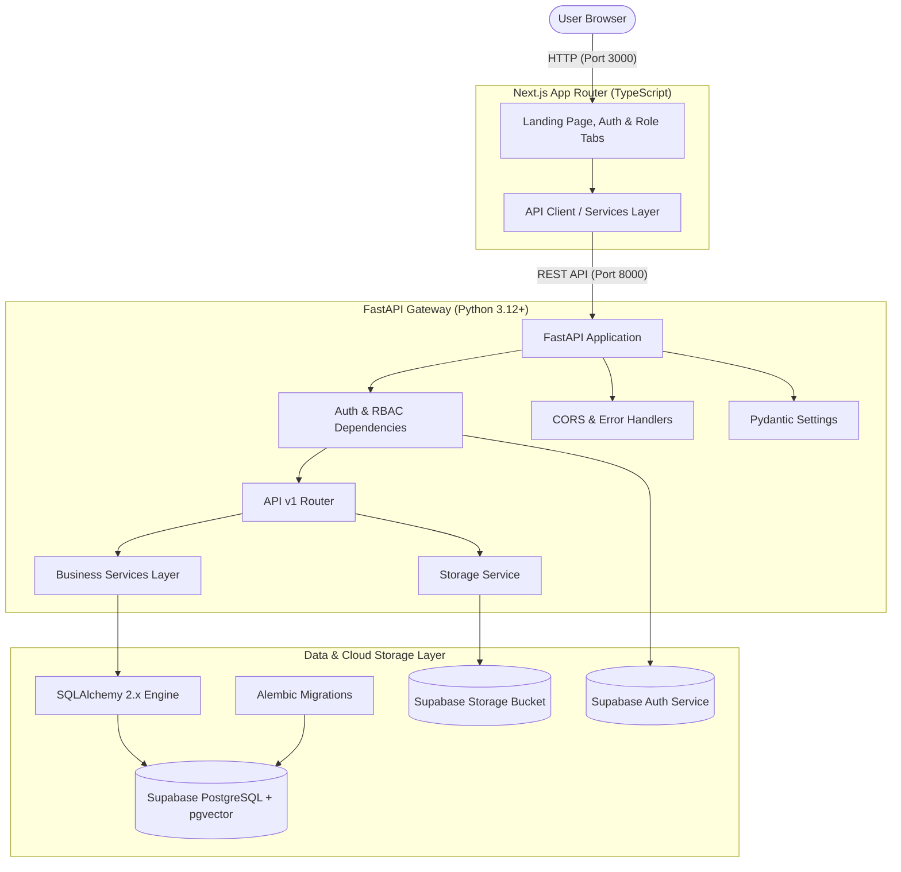

# TalentForge Architecture & Technical Foundation

## 1. Overview
TalentForge is an enterprise AI-powered hiring platform designed to modernize candidate sourcing, evaluation, and interview workflows. 

- **Phase 1: Project Foundation**: Established a modular, decoupled, and production-oriented skeleton focusing on system reliability, type safety, environment configuration, and automated health telemetry.
- **Phase 2: Database & Storage**: Establishes the relational schema, Supabase PostgreSQL connection, pgvector embedding foundation, and Supabase Storage resume management pipeline.
- **Phase 3: Authentication & RBAC**: Integrates Supabase Auth with JWT access token verification, PostgreSQL user profile linkage, server-enforced role permissions (ADMIN, RECRUITER, CANDIDATE), candidate resource ownership checks, and role-aware frontend portals.

---

## 2. System Architecture

---

## 3. Core Modules & Boundaries

### Frontend (`/frontend`)
- **Framework**: Next.js 14 (App Router) with TypeScript.
- **Styling**: Vanilla CSS design system (`globals.css`) with glassmorphic aesthetic, status badges, and interactive verification tabs.
- **Service Layer**: Typed API client (`src/services/api.ts`) managing requests for companies, jobs, candidates, resumes, applications, and system health.
- **Components**: Modular atomic structure:
  - `HealthStatusCard`: Live `/api/v1/health` telemetry.
  - `CompaniesTab`: Company creation and catalog view.
  - `JobsTab`: Job posting form with company selection.
  - `CandidatesTab`: Candidate registration and resume document upload.
  - `ApplicationsTab`: Job application linking and directory view.

### Backend (`/backend`)
- **Framework**: FastAPI with asynchronous lifespan lifecycle handlers.
- **Configuration**: Pydantic Settings (`app/core/config.py`) parsing `.env` files with validation, Supabase keys, and future AI placeholders.
- **Storage Layer**: `app/services/storage.py` uploading candidate resumes to Supabase Storage with local resilient fallback for offline/test environments.
- **Database Engine**: SQLAlchemy 2.x declarative base and connection pool (`app/db/session.py`) with pre-ping validation.
- **pgvector Integration**: 1536-dimensional vector embedding column (`DocumentChunk.embedding`) enabling semantic vector search for subsequent RAG phases.
- **Migrations**: Alembic with environment-driven URL resolution and automatic extension creation.
- **Test Suite**: Pytest with in-memory SQLite fixtures verifying CRUD operations, foreign key constraints, file validation, and pgvector structures.

---

## 4. Environment Separation
Configuration is completely decoupled from code:
- **Development**: Local virtual environments (`uv`, `pnpm`), Supabase PostgreSQL, Supabase Storage.
- **Docker**: Containerized multi-service topology through `docker-compose.yml`.
- **Test**: Isolated test runner utilizing mock/in-memory fixtures to guarantee 100% deterministic test execution.
