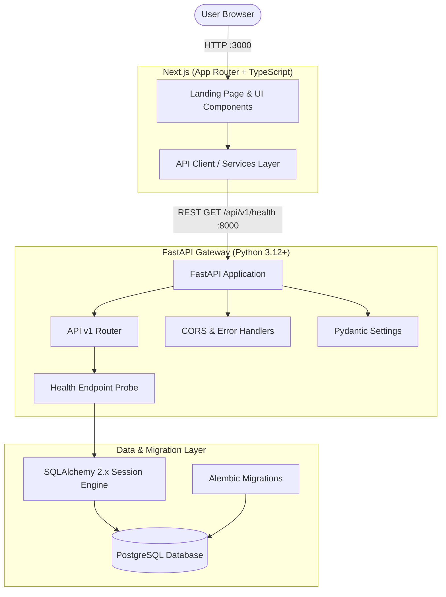

# TalentForge Architecture & Technical Foundation

## 1. Overview
TalentForge is an AI-powered hiring platform designed to modernize candidate sourcing, evaluation, and interview workflows. **Phase 1: Project Foundation** establishes a modular, decoupled, and production-oriented skeleton focusing on system reliability, type safety, environment configuration, and automated health telemetry.

---

## 2. System Architecture

---

## 3. Core Modules & Boundaries

### Frontend (`/frontend`)
- **Framework**: Next.js 14 (App Router) with TypeScript.
- **Styling**: Vanilla CSS design system (`globals.css`) with glassmorphic aesthetic, dark theme, and fluid micro-animations.
- **Service Layer**: Dedicated API client (`src/services/api.ts`) abstracting backend communication and providing typed fallback states for network resilience.
- **Components**: Modular atomic structure (`Header`, `Footer`, `HealthStatusCard`, `SystemOverview`).

### Backend (`/backend`)
- **Framework**: FastAPI with asynchronous lifespan lifecycle handlers.
- **Configuration**: Pydantic Settings (`app/core/config.py`) parsing `.env` files with validation, fallback defaults, and future feature placeholders (`LLM_API_KEY`, `LANGFUSE_*`).
- **Telemetry**: `/api/v1/health` verifying both web gateway status and executing active database probes via `SELECT 1`.
- **Database Engine**: SQLAlchemy 2.x declarative base and connection pool (`app/db/session.py`) with pre-ping validation.
- **Migrations**: Alembic with environment-driven URL resolution (`alembic/env.py`).

---

## 4. Environment Separation
Configuration is completely decoupled from code:
- **Development**: Local virtual environments (`uv`, `pnpm`), local PostgreSQL or Supabase.
- **Docker**: Containerized multi-service topology through `docker-compose.yml`.
- **Test**: Isolated test runner utilizing mock/in-memory fixtures to guarantee test reliability.
